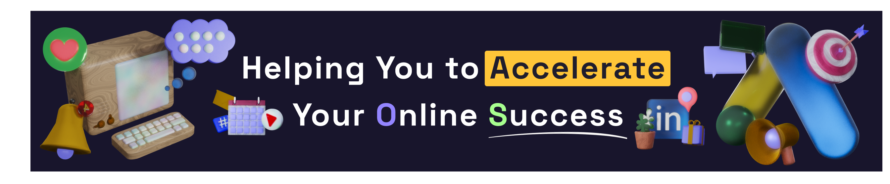

###

<h1 align="center">Hi there 👋, I'm Karel Hernández 👨‍💻</h1>

<h3 align="center">Full-Stack Developer • Blockchain Enthusiast • Game Developer</h3>

  

###

  
  

###

<picture>
  <source media="(prefers-color-scheme: dark)" srcset="https://raw.githubusercontent.com/karel95/karel95/output/pacman-contribution-graph-dark.svg">
  <source media="(prefers-color-scheme: light)" srcset="https://raw.githubusercontent.com/karel95/karel95/output/pacman-contribution-graph.svg">
  
</picture>

###

  

###

---

> [!NOTE]
> ### 🚀 About Me
>
> 🌱 I'm a passionate Full-Stack Developer and emerging Blockchain Specialist with a love for creating powerful and scalable web, app, and game experiences.  
> 🎮 I enjoy programming videogames and experimenting with cutting-edge tech like smart contracts and NFTs.  
> 🤝 I'm always open to collaborate on exciting projects and sharpen my skills.

### 🛠️ Tech Stack

     
  

    
    
    
    
    
    
    
    
    
    
    
    
    
    
    
    
    
    
  

###

> [!TIP]
> ### 🧠 Let's Collaborate!
>
> - 💡 I’m looking to contribute to open-source projects and real-world applications to grow my experience.
> - 🔥 Always exploring new tech and keeping up with the latest in Web3 and full-stack development.

### 📫 Contact Me

  
  

---

> [!IMPORTANT] 
> *“Code is like humor. When you have to explain it, it’s bad.” – Cory House*

<!---
Karel95/Karel95 is a ✨ special ✨ repository because its `README.md` (this file) appears on your GitHub profile.
You can click the Preview link to take a look at your changes.
--->
